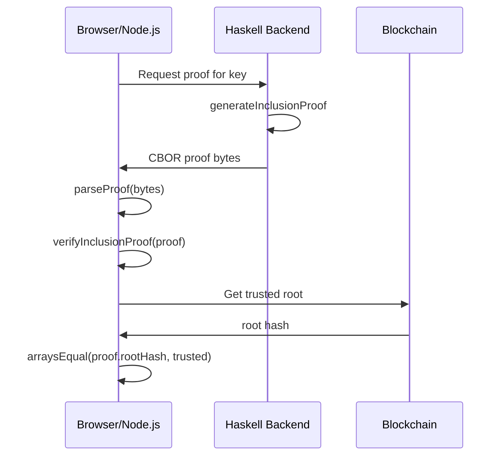

# TypeScript Verifier

A TypeScript library for verifying CSMT inclusion proofs client-side.
This enables browser and Node.js applications to verify proofs without
a Haskell runtime.

## Installation

```bash
npm install @paolino/csmt-verify
```

Or with yarn:

```bash
yarn add @paolino/csmt-verify
```

## Quick Start

```typescript
import { parseProof, verifyInclusionProof, arraysEqual } from '@paolino/csmt-verify';

// Parse CBOR-encoded proof bytes
const proof = parseProof(proofBytes);

// Verify the proof is internally consistent
if (verifyInclusionProof(proof)) {
    console.log('Proof structure is valid');

    // Compare against your trusted root hash
    if (arraysEqual(proof.proofRootHash, trustedRootHash)) {
        console.log('Proof verified against trusted root!');
    }
}
```

## API Reference

### Types

```typescript
type Direction = 0 | 1;  // L=0, R=1
type Key = Direction[];
type Hash = Uint8Array;  // 32 bytes (Blake2b-256)

interface Indirect {
    jump: Key;
    value: Hash;
}

interface ProofStep {
    stepConsumed: number;
    stepSibling: Indirect;
}

interface InclusionProof {
    proofKey: Key;
    proofValue: Hash;
    proofRootHash: Hash;
    proofSteps: ProofStep[];
    proofRootJump: Key;
}
```

### Functions

#### `parseProof(bytes: Uint8Array): InclusionProof`

Parse CBOR-encoded proof bytes into an `InclusionProof` object.

```typescript
const proof = parseProof(cborBytes);
console.log('Key length:', proof.proofKey.length);
console.log('Steps:', proof.proofSteps.length);
```

Throws an error if the bytes are not valid CBOR or don't match the expected format.

#### `verifyInclusionProof(proof: InclusionProof): boolean`

Verify that a proof is internally consistent by recomputing the root hash
and comparing it to the claimed `proofRootHash`.

```typescript
const isValid = verifyInclusionProof(proof);
```

Returns `true` if the computed root matches the claimed root.

!!! warning "Trust Model"
    This only verifies internal consistency. You must separately verify
    that `proofRootHash` matches your trusted root hash.

#### `computeRootHash(proof: InclusionProof): Hash`

Compute the Merkle root hash from the proof data. Useful when you need
the computed hash for comparison with multiple trusted roots.

```typescript
const computed = computeRootHash(proof);
```

#### `verifyProofBytes(bytes: Uint8Array): boolean`

Convenience function that parses and verifies in one call.

```typescript
const isValid = verifyProofBytes(cborBytes);
```

#### `arraysEqual(a: Uint8Array, b: Uint8Array): boolean`

Compare two byte arrays for equality. Useful for comparing hashes.

```typescript
if (arraysEqual(proof.proofRootHash, trustedRoot)) {
    // Root matches
}
```

### Advanced Functions

For custom implementations or debugging:

```typescript
import {
    blake2b256,      // Compute Blake2b-256 hash
    rootHash,        // Hash an Indirect value
    combineHash,     // Combine two Indirect values
    serializeKey,    // Serialize Key to bytes
    serializeIndirect // Serialize Indirect to bytes
} from '@paolino/csmt-verify';
```

## Usage Examples

### Verify Against Trusted Root

```typescript
import { parseProof, verifyInclusionProof, arraysEqual } from '@paolino/csmt-verify';

async function verifyMembership(
    proofBytes: Uint8Array,
    trustedRoot: Uint8Array
): Promise<boolean> {
    const proof = parseProof(proofBytes);

    // Check internal consistency
    if (!verifyInclusionProof(proof)) {
        return false;
    }

    // Check against trusted root
    return arraysEqual(proof.proofRootHash, trustedRoot);
}
```

### Browser Usage

The library works in browsers with no additional configuration:

```html
<script type="module">
import { parseProof, verifyInclusionProof } from '@paolino/csmt-verify';

// Fetch proof from your API
const response = await fetch('/api/proof/mykey');
const proofBytes = new Uint8Array(await response.arrayBuffer());

const proof = parseProof(proofBytes);
const isValid = verifyInclusionProof(proof);

document.getElementById('result').textContent =
    isValid ? 'Valid' : 'Invalid';
</script>
```

### Extracting Proof Data

```typescript
import { parseProof, L, R } from '@paolino/csmt-verify';

const proof = parseProof(proofBytes);

// Convert key to hex string
const keyHex = proof.proofKey
    .map(d => d === L ? '0' : '1')
    .join('');

// Get value and root hashes as hex
const valueHex = Buffer.from(proof.proofValue).toString('hex');
const rootHex = Buffer.from(proof.proofRootHash).toString('hex');

console.log(`Key: ${keyHex}`);
console.log(`Value hash: ${valueHex}`);
console.log(`Root hash: ${rootHex}`);
console.log(`Proof steps: ${proof.proofSteps.length}`);
```

## Integration with Haskell Backend

The TypeScript library verifies proofs generated by the Haskell CSMT library.

### Workflow



### Generating Proofs (Server)

```haskell
-- Haskell backend
import CSMT.Hashes (generateInclusionProof, fromKVHashes)

handleProofRequest :: ByteString -> Transaction m cf d ops (Maybe ByteString)
handleProofRequest key = do
    result <- generateInclusionProof fromKVHashes kvCol csmtCol key
    pure $ fmap snd result  -- Return just the proof bytes
```

### Verifying Proofs (Client)

```typescript
// TypeScript client
const response = await fetch(`/proof/${key}`);
const proofBytes = new Uint8Array(await response.arrayBuffer());

const proof = parseProof(proofBytes);
if (verifyInclusionProof(proof)) {
    // Proof is valid, check against your trusted root
}
```

## Development

The TypeScript package has its own Nix flake for development:

```bash
cd verifiers/typescript

# Enter development shell
nix develop

# Install dependencies
npm install

# Run tests
npm test

# Or run tests via Nix
nix run .#test

# Build
npm run build
```

## Dependencies

- [cbor-x](https://www.npmjs.com/package/cbor-x) - Fast CBOR decoder
- [blakejs](https://www.npmjs.com/package/blakejs) - Blake2b implementation

Both work in Node.js and browsers.
